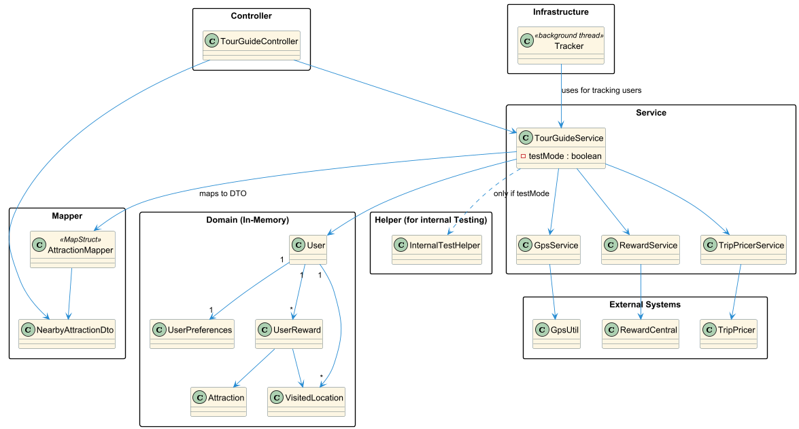

# TourGuide - Travel Recommendation Application

A Spring Boot application that helps users discover nearby attractions and get personalized travel deals based on their location and reward points.

---

## Overview

TourGuide is a web-based travel guide service that provides:
- **User Location Tracking**: Track user positions in real-time using GPS
- **Nearby Attractions**: Find the 5 closest attractions to the user's current location
- **Reward Management**: Track user reward points and visited attractions
- **Trip Deals**: Generate personalized travel deals based on user preferences and reward points

---

## App Architecture 
### Diagram 
the TourGuide architecture diagram is available in the `docs/diagram/tourguide-architecture.png` file.



## Technologies

| Technology | Version |
|-----------|---------|
| **Java** | 21 |
| **Spring Boot** | 3.1.1 |
| **JUnit** | 5 |
| **Build Tool** | Maven |
| **Lombok** | 1.18.36 |
| **MapStruct** | 1.6.0 |
| **Testing** | Mockito 5.13.0, JUnit 5, Awaitility 4.2.0 |

---

## Getting Started

### Prerequisites
- Java 21 or higher
- Maven 3.6+
- Windows/macOS/Linux

### Setup & Installation

#### 1. Install Local JAR Dependencies

The project uses three external libraries stored in the `/libs` folder. Install them in your local Maven repository:

```bash
mvn install:install-file -Dfile=libs/gpsUtil.jar -DgroupId=gpsUtil -DartifactId=gpsUtil -Dversion=1.0.0 -Dpackaging=jar

mvn install:install-file -Dfile=libs/RewardCentral.jar -DgroupId=rewardCentral -DartifactId=rewardCentral -Dversion=1.0.0 -Dpackaging=jar

mvn install:install-file -Dfile=libs/TripPricer.jar -DgroupId=tripPricer -DartifactId=tripPricer -Dversion=1.0.0 -Dpackaging=jar
```

#### 2. Build the Project

```bash
mvn clean package
```

#### 3. Run the Application

```bash
mvn spring-boot:run
```

The application will start on **http://localhost:8081**

---

## REST API Endpoints

| Method | Endpoint | Description | Parameters |
|--------|----------|-------------|-----------|
| GET | `/` | Welcome message | - |
| GET | `/getLocation` | Get user's current location | `userName` (String) |
| GET | `/getNearbyAttractions` | Get 5 closest attractions | `userName` (String) |
| GET | `/getRewards` | Get user's rewards history | `userName` (String) |
| GET | `/getTripDeals` | Get personalized trip deals | `userName` (String) |

### Example Requests

```bash
# Get location
curl "http://localhost:8081/getLocation?userName=internalUser0"

# Get nearby attractions
curl "http://localhost:8081/getNearbyAttractions?userName=internalUser0"

# Get rewards
curl "http://localhost:8081/getRewards?userName=internalUser0"

# Get trip deals
curl "http://localhost:8081/getTripDeals?userName=internalUser0"
```

---

## Configuration

Key application properties in `application.properties`:

```properties
spring.application.name=tour-guide
server.port=8081                           # Server port
logging.level.com.openclassrooms.tourguide=DEBUG

# Reward proximity configuration
reward.default.proximity.buffer=10          # Miles (proximity buffer for rewards)
reward.attraction.proximity.range=200       # Miles (range to find attractions)

# TripPricer API
trip.pricer.api.key=test-server-api-key   # API key for trip pricing service
```

---

## Testing

### Run All Tests
```bash
mvn test
```

### Test Classes
- `TestTourGuideService.java` - Core service functionality tests
- `TestRewardsService.java` - Reward calculation tests
- `TestPerformance.java` - Performance and load tests

### Key Testing Tools
- **JUnit 5**: Test framework
- **Mockito**: Mocking dependencies
- **Awaitility**: Async testing utilities

---

## Architecture

### Controller Layer
- **TourGuideController**: REST API controller handling HTTP requests
  - Maps incoming requests to service methods
  - Returns JSON responses for all endpoints
  - Manages user parameter validation
  - Routes to `/getLocation`, `/getNearbyAttractions`, `/getRewards`, `/getTripDeals` endpoints

### Service Layer
- **TourGuideService**: Main orchestrator for all operations
- **GpsService**: Handles location tracking using gpsUtil library
- **RewardsService**: Calculates rewards for visited attractions
- **TripPricerService**: Generates trip deals using tripPricer library

### Data Models
- **User**: Core user entity with location and reward information
- **UserReward**: Tracks rewards earned at visited attractions
- **VisitedLocation**: Records user location at specific timestamps

### DTOs
- **NearbyAttractionDto**: Formatted attraction data for API responses

---

## Main Business Flows

### 1. User Location Tracking
1. User requests location via API
2. GpsService fetches current GPS coordinates
3. Location is tracked and stored
4. Rewards are calculated for nearby attractions

### 2. Finding Nearby Attractions
1. Get user's current location
2. Search for attractions within 200-mile radius
3. Calculate distances to 5 closest attractions
4. Return formatted attraction data with distances

### 3. Reward Management
1. Track user visits to attractions
2. Calculate reward points based on proximity
3. Store rewards in user's reward history
4. Consider rewards when generating trip deals

### 4. Trip Deal Generation
1. Fetch user profile and rewards
2. Query TripPricer service with user preferences
3. Generate personalized deals
4. Return sorted list of best deals